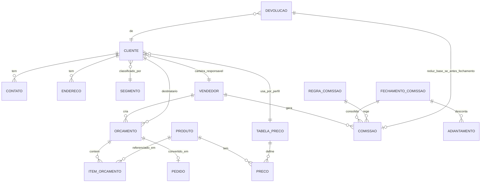
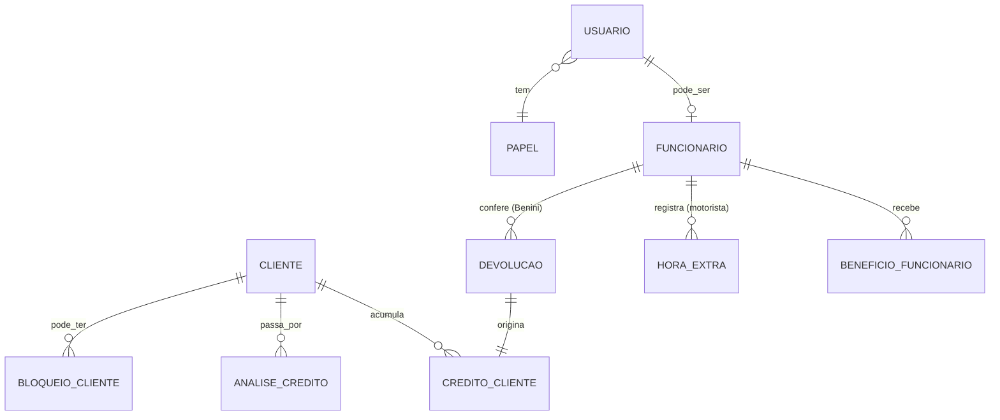

# Modelo Conceitual Inicial

> Entidades e relações derivadas das descobertas. Serve para discussão — **não modela banco ainda**.
> 🔥 = MVP · 🟡 = Fase 2/3 · ⚪ = futuro/externo.

---

## 1. Núcleo Comercial + Comissão (MVP)

## 2. Crédito · Devolução · Bloqueio (PROC-003/004/005)

---

## 3. Dicionário de entidades (conceitual)

| Entidade | Atributos conceituais (sem tipo de banco) | Fase |
|---|---|---|
| **Cliente** | nome, fantasia, CNPJ/CPF, segmento, status, funil, vendedor responsável, flags fiscais | 🔥 |
| **Contato** | tipo (tel/WhatsApp/e-mail), valor, principal | 🔥 |
| **Endereço** | logradouro, nº, bairro, município, UF, principal | 🔥 (1) |
| **Segmento** | nome (ex.: CMI, Laticínio, Metalúrgica) | 🔥 |
| **Vendedor** (Comissionado) | nome, % comissão padrão, desconto máx, liberação crédito % | 🔥 |
| **Orçamento/Pré-venda** | número, condição (à vista/prazo), desconto, IPI/frete, total, status | 🔥 |
| **Item de Orçamento** | produto, quantidade, unidade, preço, subtotal | 🔥 |
| **Produto** | descrição, unidade (KG/MT/PC/UN) | 🔥 (consulta) |
| **Tabela de Preço** | nome (REVENDA/CONSUMIDOR) | 🔥 |
| **Preço** | produto × tabela, à vista, a prazo | 🔥 |
| **Pedido** | origem (orçamento), status | 🟡 |
| **Comissão** | vendedor, período, base líquida, %, valor | 🔥 |
| **Regra de Comissão** | % padrão (1%); *override por cliente = futuro* | 🔥 (padrão) / ⚪ (override) |
| **Fechamento de Comissão** | período, responsável (Roberta), total | 🔥 |
| **Adiantamento** | vendedor, valor, data | 🔥 |
| **Devolução** | cliente, itens, confirmação física, data | 🔥 (modelo) |
| **CréditoCliente** | cliente, valor, origem (devolução), data | 🔥 (modelo) |
| **BloqueioCliente** | cliente, ~~motivo/data/responsável~~ | ⚪ (validar) |
| **AnáliseCrédito** | cliente, Serasa, referências, parecer, limite | 🟡/🟡 |
| **Usuário** | login, papel, estação | 🔥 |
| **Papel/Permissão** | nome, permissões (ver comissão, aprovar desconto) | 🔥 |
| **Funcionário** | nome, papéis (vendedor/motorista/conferente…) | 🔥 (vendedor) |
| **BenefícioFuncionário** | tipo (alimentação), valor/dia, dias | ⚪ externo |
| **HoraExtra** | funcionário (motorista), horários, total | ⚪ externo |
| **Carteira/Região** | vendedor, clientes, contato principal | 🔥 (vínculo) / 🟡 (regras) |

---

## 4. Decisões conceituais (alinhadas à governança)
1. **Comissionado** abstrai Vendedor (e, no futuro, Indicador Externo) — comissão não acopla a "vendedor".
2. **RegraComissão** com % padrão **1%**; o **override por cliente fica como atributo futuro** (não modelar
   exceção até validar se há clientes além da Lucilene).
3. **Comissão** liga-se a **Fechamento** (período) → devolução tardia não altera comissão paga.
4. **Devolução → CréditoCliente** só após confirmação física (Benini) + confirmação (Roberta).
5. **BloqueioCliente** existe como conceito, mas **sem atributos motivo/data/responsável no MVP** (validar).
6. **Sem `empresa_id`** — operação mono-CNPJ.

---

## Histórico de Versões
| 1.0.0 | 2026-06-23 | Criação — modelo conceitual (2 diagramas ER + dicionário) |
