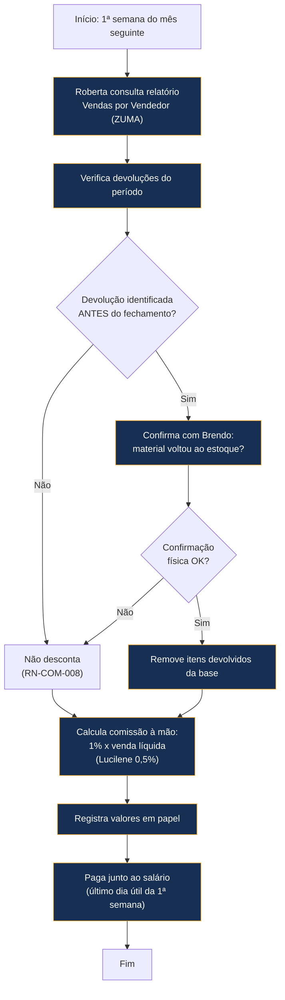
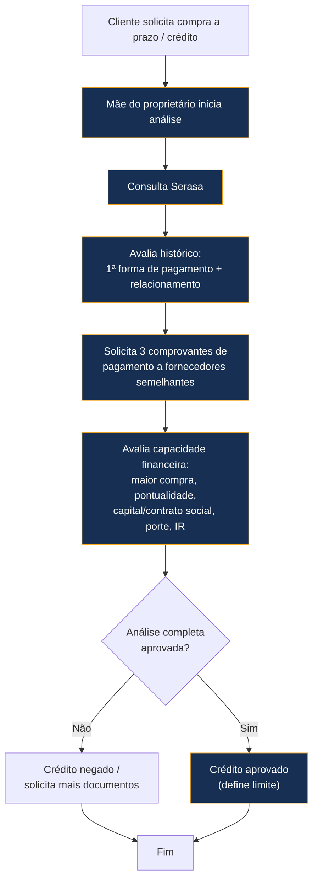
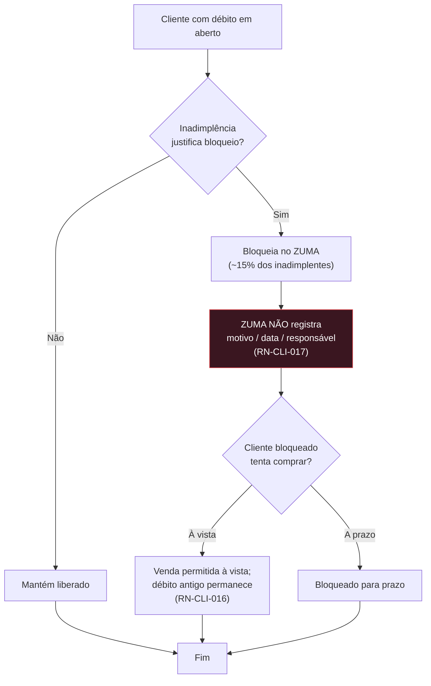
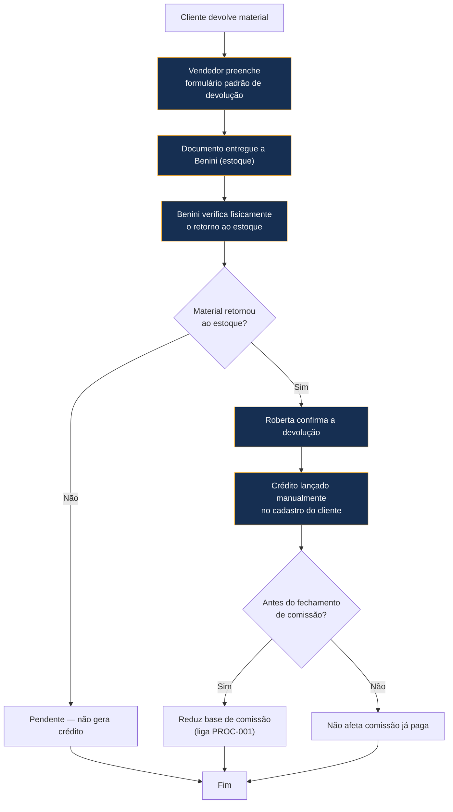

# Fluxogramas dos Processos (AS-IS)

> Diagramas Mermaid do funcionamento **real atual**. Não representam o ERP futuro.

---

## 1. Fechamento de Comissão (PROC-001)

**Problemas:** 100% manual; sem histórico; sem rastreabilidade; depende de Roberta e Brendo.

---

## 2. Concessão de Crédito (PROC-003)

**Problemas:** sem workflow formal; critérios não documentados; decisão concentrada em 1 pessoa.

---

## 3. Bloqueio de Clientes (PROC-004)

**Oportunidade (não-MVP até validar):** registrar motivo, data, responsável e histórico de liberações.

---

## 4. Devolução com Geração de Crédito (PROC-005)

**Problemas:** baseado em papel; conferência manual; sem rastreabilidade digital.

---

## Histórico de Versões
| Versão | Data | Mudanças |
|---|---|---|
| 1.0.0 | 2026-06-23 | Criação — 4 fluxogramas AS-IS (comissão, crédito, bloqueio, devolução) |
