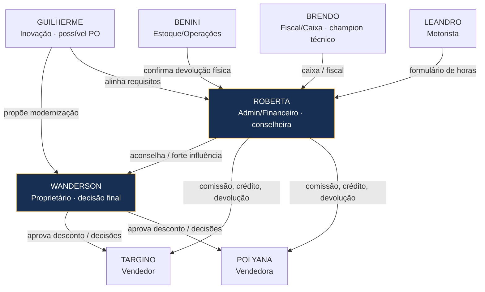
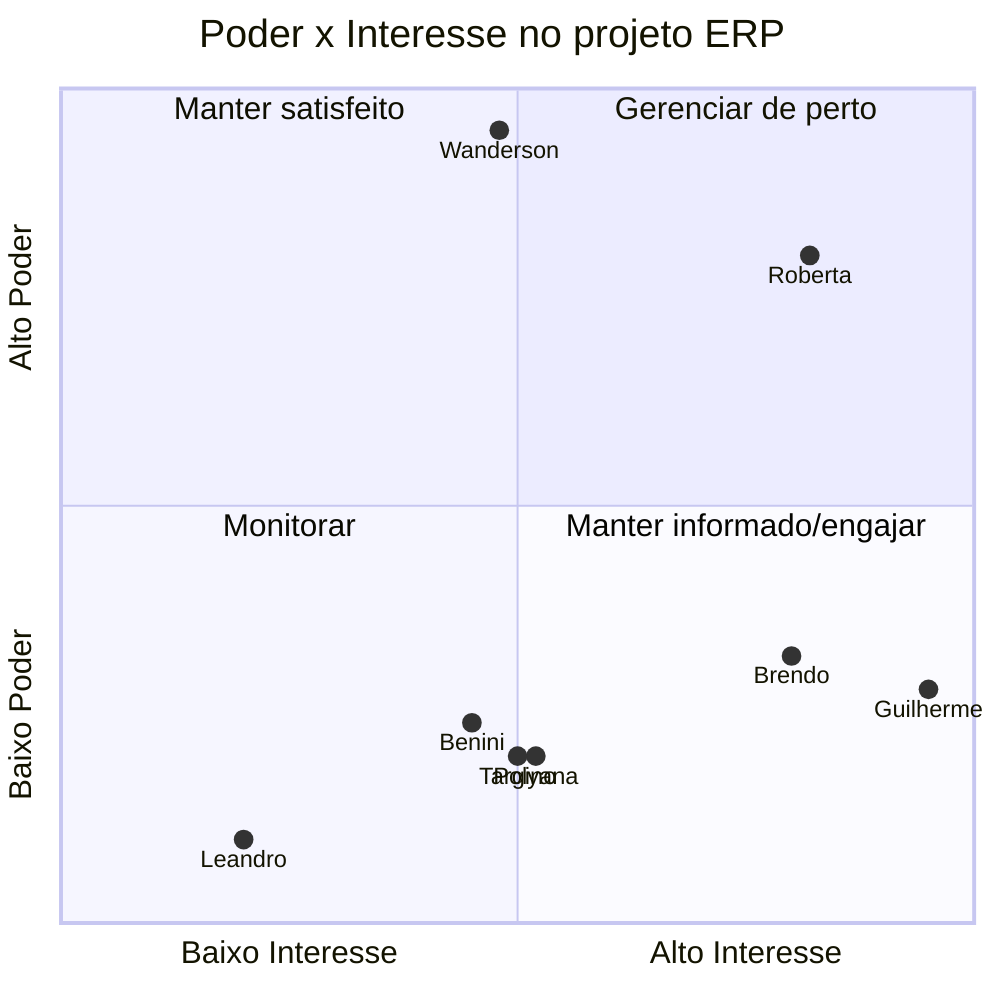

# Mapa de Influência Organizacional

> Base para **estratégia de adoção** e ordem de envolvimento. Escalas de descoberta — validar.

---

## 1. Mapa de influência (quem influencia quem)

> **Caminho de adoção:** Guilherme (PO) → conquista **Roberta** → Roberta sustenta junto a **Wanderson**.
> Sem Roberta convencida, a decisão de Wanderson não se sustenta no dia a dia.

---

## 2. Matriz Poder × Interesse

| Quadrante | Pessoas | Estratégia |
|---|---|---|
| Gerenciar de perto (poder+interesse altos) | **Roberta** | Co-criar, decisões de processo |
| Manter satisfeito (poder alto, interesse médio) | **Wanderson** | Mostrar valor sem tirar autonomia; demos curtas |
| Manter informado/engajar (interesse alto, poder baixo) | **Guilherme, Brendo** | PO e piloto — protagonistas da implantação |
| Monitorar (baixo/baixo) | Targino, Polyana, Benini, Leandro | Treinar; ouvir dores; simplicidade |

---

## 3. Matriz Resistência à Mudança × Impacto na adoção

| Pessoa | Resistência | Maturidade | Impacto se resistir | Estratégia |
|---|---|---|---|---|
| **Wanderson** | Média/Alta | 2/5 | 🔴 Crítico (decide tudo) | Envolver cedo; ERP como apoio à decisão, não substituto; ganhos visíveis |
| **Roberta** | Média | 3/5 | 🔴 Crítico (usuária-chave) | Respeitar Excel (importar/exportar); migração gradual; co-design |
| **Benini** | Média/Alta | 2/5 | 🟡 Médio (operacional) | UI simples; treinar no físico (devolução/estoque) |
| **Targino** | Média | 2/5 | 🟡 Médio | Treino prático; mostrar velocidade no orçamento |
| **Polyana** | Média | 2/5 | 🟡 Médio | Idem; revisar processo de confirmação WhatsApp |
| **Leandro** | n/d | 1/5 | 🟢 Baixo (externo) | Fora do MVP; eventual app simples no futuro |
| **Brendo** | Baixa | 4/5 | 🟢 Baixo (aliado) | **Champion / piloto** |
| **Guilherme** | Muito baixa | 5/5 | 🟢 Baixo (motor) | **PO / condutor** |

> **Risco-chave de adoção:** combinação **alto poder + alta resistência + baixa maturidade** =
> **Wanderson**. Mitigar com entregas pequenas, valor imediato (comissão/dashboard) e zero perda de controle.

---

## 4. Usuários-chave para entrevistas e implantação

| Prioridade | Pessoa | Papel na descoberta | Papel na implantação |
|---|---|---|---|
| 1 | **Roberta** | Comissão, crédito, devolução, fechamento | Usuária-âncora / validação |
| 2 | **Wanderson** | Decisão, aprovação de desconto, carteira | Patrocinador |
| 3 | **Brendo** | Caixa/fiscal | **Piloto / champion técnico** |
| 4 | **Benini** | Devolução física, estoque | Validação operacional |
| 5 | **Targino + Polyana** | Carteira, orçamento, WhatsApp | Usuários diários |
| 6 | **Leandro** | Horas extras/pernoite (externo) | Fora do MVP |

---

## Histórico de Versões
| 1.0.0 | 2026-06-23 | Criação — mapa de influência, Poder×Interesse, Resistência, usuários-chave |
